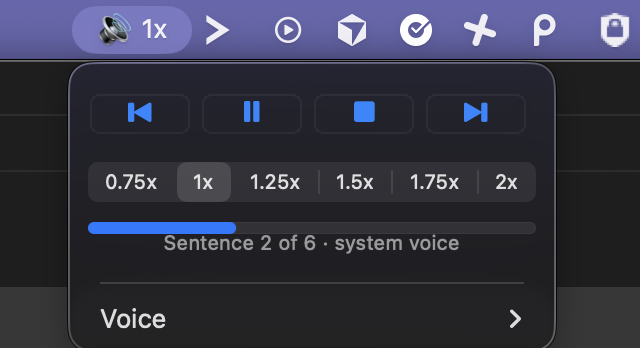

# claude-say

Listen to a Claude Code response instead of reading it. You pick which one.



Type `!say` in Claude Code: the previous response is spoken aloud and a player
appears in the menu bar. It disappears when the text ends. Nothing speaks on its
own — no hooks, no daemon, no microphone.

## Install

```sh
git clone https://github.com/shamrai-nikita/claude-say && cd claude-say && ./install.sh
```

macOS, Xcode Command Line Tools, `~/.local/bin` on PATH. No other dependencies.

## Use

| Command | |
|---|---|
| `!say` | speak the last response |
| `!say 3` | speak the 3rd-from-last response |
| `!say -l` | list the last 10 responses, pick a number |
| `!say -t` | print the text, speak nothing |
| `!say --stop` | stop and remove the menu bar item |

Player: back / play-pause / stop / skip a sentence, speed 0.75x–2x, voice, and a
progress bar. Speed and voice are remembered.

Each sentence picks its own voice: Cyrillic text switches to a Russian voice,
everything else uses your system voice.

## How it works

`bin/say` reads the session transcript in `~/.claude/projects/`, strips
markdown, and launches `bin/say-menu` — an AppKit status item that runs
`/usr/bin/say` once per sentence. One process per sentence is what makes a live
speed or voice change possible.

`say` shadows `/usr/bin/say` on PATH and forwards anything that is not its own
flags, so the system command keeps working.

Stuck? See [TROUBLESHOOTING.md](TROUBLESHOOTING.md). Working on the code? See
[CLAUDE.md](CLAUDE.md).

## License

MIT
