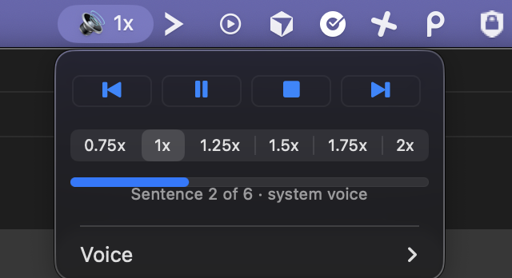

# claude-say

Listen to a Claude Code response instead of reading it. You pick which one.



Type `!say` in Claude Code: the previous response is spoken aloud and a player
appears in the menu bar. It disappears when the text ends. Nothing speaks on its
own — no hooks, no daemon, no microphone.

## Install

```sh
git clone https://github.com/shamrai-nikita/claude-say && cd claude-say && ./install.sh
```

macOS, Xcode Command Line Tools, `~/.local/bin` on PATH. Neural voices also need
[`uv`](https://docs.astral.sh/uv/); without it the player uses macOS voices.

## Use

| Command | |
|---|---|
| `!say` | speak the last response |
| `!say 3` | speak the 3rd-from-last response |
| `!say -l` | list the last 10 responses, pick a number |
| `!say -t` | print the text, speak nothing |
| `!say --stop` | stop and remove the menu bar item |

Player: back / play-pause / stop / skip a sentence, speed 0.75x–2x, voice, and a
progress bar. Speed and voice are remembered.

**Voices.** The default is **Auto**: each sentence with any Russian word is read
by Dmitry, the rest by Andrew. Pick another one under **Voice** in the player:

- **Neural voices** (online): Auto, Andrew, Ava, Brian, Emma (multilingual),
  Dmitry, Svetlana (Russian). A multilingual voice reads a Russian sentence
  with an accent once it holds an English word: "ждёт" comes out as "ждиет".
  Dmitry reads Russian correctly and English terms with a Russian accent. The text goes to Microsoft's Edge Read Aloud service, with
  no account; Microsoft says it deletes the text right after conversion.
- **Offline — Silero**: neural Russian voice on this Mac, nothing is sent. English
  words are rewritten in Cyrillic first, so they sound rougher. First use
  downloads torch (a few hundred MB) and a 145 MB model.
- **macOS voices**: the old engine. Cyrillic sentences use a Russian voice, the
  rest your system voice. No network.

If a neural render fails (offline, service down), that sentence uses the macOS voice.

Tables are read row by row: "Header: value, Header: value". File paths are
shortened to the file name, URLs become "link". Numbers with a suffix are read
as words in the right form: "4-й" is "четвёртый", "во 2-м" is "во втором",
"из 3-х" is "из трёх".

**Your own pronunciation rules** go in `~/.config/claude-say/pronounce.txt`
(created on first use, with examples), one per line:

```
k8s = кубернетис
re: (\d+)\s*мс = \1 миллисекунд
```

Check a rule without listening: `speak --print "text"`.

`speak` is the same engine on its own: `speak "текст"`, `pbpaste | speak`,
`speak --local "..."` (offline), `speak --print` (show the cleaned text).

## How it works

`bin/say` reads the session transcript in `~/.claude/projects/`, strips
markdown, and launches `bin/say-menu` — an AppKit status item that plays one
sentence per process. With a neural voice it renders each sentence to a file
with `bin/speak` (two sentences ahead) and plays it with `afplay`; with a macOS
voice it runs `/usr/bin/say`. One process per sentence is what makes a live
speed or voice change possible.

`say` shadows `/usr/bin/say` on PATH and forwards anything that is not its own
flags, so the system command keeps working.

Stuck? See [TROUBLESHOOTING.md](TROUBLESHOOTING.md). Working on the code? See
[CLAUDE.md](CLAUDE.md).

## License

MIT
